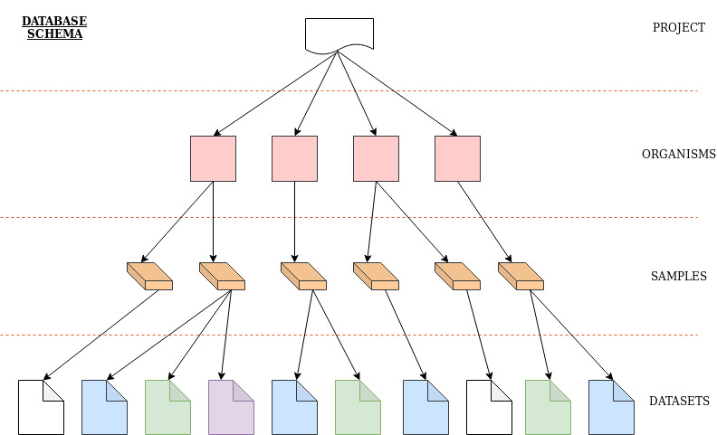

MSD
===

.. autosummary::
   :toctree: generated

.. _Database Structure:

******************
Database Structure
******************

MSD databse has a hierarchical structure. We have the concepts of **Projects**, **Organisms**, **Samples**, and **Datasets**.
As a user has defined a project, the new project can host various *organisms*, *samples* and *datasets*. A defined *organism*
can have several samples assigned to and similarly each *sample* might have various *datasets*.

Take this hypothetical sitaion into consideration. As a researcher you might have project in which you have three mice.
In this case each each mouse would be an *organism* at MSD. Suppose that you plan to compare two types of samples 
(colon biopsy and faeces) and two microbiome anlaysis methods (16S amplicon and Shotgun sequencing). In 
order to achieve this you need to attempt one sampling for each sample type and get enough sample for 
each sample type to send for different sequencing methods. It means that you would take 2 samples from each mouse 
and produce 2 datasets from each sample. Thus, you need to define all your mice as *organism* at MSD and 
for each of them define only **2** *samples* for which **2** *datasets* would get generated and uploaded to MSD. The table below
shows the case.

.. _Concepts Relaion::
.. csv-table:: Concepts Relation at MSD
   :header: "No.", "Organism", "Sample", "Dataset Type"
   :widths: 5, 10, 10, 20

   "1", "Mouse_1", "Biopsy", "16S Amplicon"
   "2", "Mouse_1", "Biopsy", "Shotgun"
   "3", "Mouse_1", "faeces", "16S Amplicon"
   "4", "Mouse_1", "faeces", "Shotgun"
   "5", "Mouse_2", "Biopsy", "16S Amplicon"
   "6", "Mouse_2", "Biopsy", "Shotgun"
   "7", "Mouse_2", "faeces", "16S Amplicon"
   "8", "Mouse_2", "faeces", "Shotgun"
   "9", "Mouse_3", "Biopsy", "16S Amplicon"
   "10", "Mouse_3", "Biopsy", "Shotgun"
   "11", "Mouse_3", "faeces", "16S Amplicon"
   "12", "Mouse_3", "faeces", "Shotgun"

The table above ..

.. note::
   The definion of a *sample* refers to each attempt of sampling. For example, two samples, both taken from
   faeces, at the same timepoint would be considered two distintuished samples so that two differnt sample 
   objects at MSD.

